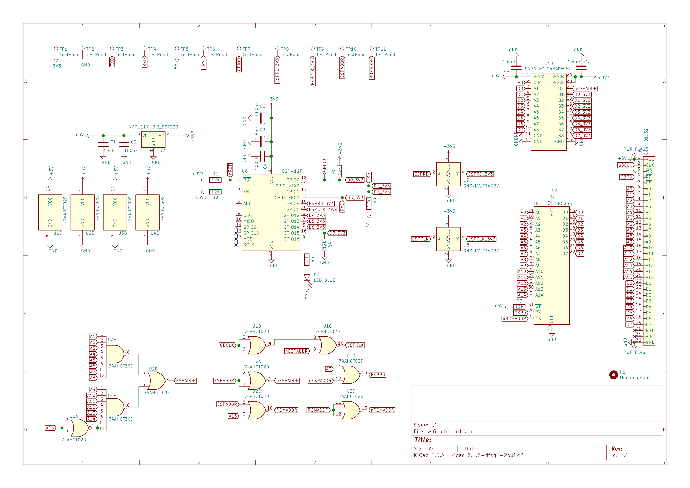

# Notes on the PCB design

There are two known possible issues in this design, which you should be aware of when ordering or manufacturing this PCB:
* Some of the 3V3 lines in the top left corner are done es part of an auto-fill area. This works perfectly in KiCad, is properly exported to Gerber files and also passes bug tests with the net list. However, when I ordered from aisler.net where you upload the KiCad file instead of Gerber files, the smaller 3V3 connections were lost. Since this worked in KiCad itself, I think it is a bug in Aisler's renderer, but unfortunately, they did not reply to my questions about this issue.
* I heavily use vias in solder pads. I read that this is bad practice as it might be a problem for automatic manufacturing processes, but fine for hand-soldering. As I did the latter I did not notice any problems, but you should be aware if you use a different process.

# Licenses
This design is licensed under the GNU General Public License 3.0. See LICENSE file in this directory.

This project includes KiCad libraries and footprints from external sources with following license notices:

## From https://github.com/Gekkio/gb-hardware

This cartridge design uses the connector of Gekkio's GB-CART32K-A design, which is licensed under CC-BY-4.0.

## From https://github.com/adamgreig/agg-kicad

Copyright 2015, 2016 Adam Greig

Permission is hereby granted, free of charge, to any person obtaining a copy of this software and associated documentation files (the "Software"), to deal in the Software without restriction, including without limitation the rights to use, copy, modify, merge, publish, distribute, sublicense, and/or sell copies of the Software, and to permit persons to whom the Software is furnished to do so, subject to the following conditions:

The above copyright notice and this permission notice shall be included in all copies or substantial portions of the Software.

THE SOFTWARE IS PROVIDED "AS IS", WITHOUT WARRANTY OF ANY KIND, EXPRESS OR IMPLIED, INCLUDING BUT NOT LIMITED TO THE WARRANTIES OF MERCHANTABILITY, FITNESS FOR A PARTICULAR PURPOSE AND NONINFRINGEMENT. IN NO EVENT SHALL THE AUTHORS OR COPYRIGHT HOLDERS BE LIABLE FOR ANY CLAIM, DAMAGES OR OTHER LIABILITY, WHETHER IN AN ACTION OF CONTRACT, TORT OR OTHERWISE, ARISING FROM, OUT OF OR IN CONNECTION WITH THE SOFTWARE OR THE USE OR OTHER DEALINGS IN THE SOFTWARE.
